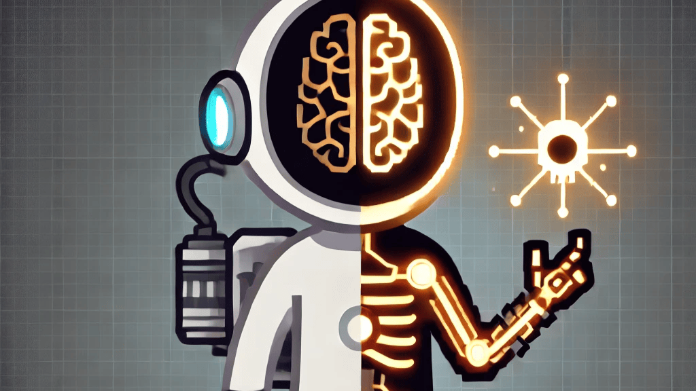

# Astraltech Bionic Implants

## Overview

Astraltech Bionic Implants is an ambitious RimWorld mod that introduces a new tier of advanced bionics, pushing the boundaries of human enhancement to extraordinary levels. Developed by a mysterious faction from beyond known space, these implants offer unprecedented abilities that border on the supernatural, allowing your colonists to transcend the limits of human capability.

---

## Features

- **41 New Bionic Parts**: Each Astraltech implant is a masterpiece of biotechnology, offering unprecedented enhancements to human capabilities.
- **16 New Adult Backstories**: Rich narratives influenced by encounters with Astraltech technology.
- **16 New Child Backstories**: Unique experiences shaped by the indirect influence of Astraltech.
- **Modular Addon System**: Many Astraltech bionics support powerful addons, allowing for further customization and enhancement.
- **Balanced Progression**: While incredibly powerful, Astraltech bionics are appropriately rare and expensive, maintaining game balance.
- **Lore-Friendly**: Seamlessly integrates into the RimWorld universe, expanding on the existing bionic and archotech concepts.
- **High-Quality Textures**: Each bionic part comes with its own unique, high-resolution texture (coming soon).
- **Crafting System**: Fabricate Astraltech bionics and addons at the hi-tech research bench.

---

# Astraltech Implants and Addons

## 🦴 Astraltech Skull

The **Astraltech Skull** offers superior protection for the brain while enhancing cognitive speed and sensory perception.

- **Cranial Reinforcement:**
  - Improves resistance to brain trauma
  - Aesthetic enhancement for a strikingly beautiful appearance

## 🧠 Astraltech Brain

The **Astraltech Brain** dramatically enhances intelligence, memory, and multitasking, making it a pinnacle of neurotechnology.

### Addons:

1. **Working Memory Augmentation:**

   - Boosts short-term memory and cognitive agility
   - Ideal for complex decision-making

2. **Emotional Regulator:**

   - Stabilizes emotional responses
   - Enhances clarity of thought and social interactions

3. **Cognitive Synchronizer:**

   - Tunes brainwaves for better focus and multitasking
   - Increases productivity

4. **Rapid Thought Accelerator:**
   - Increases brain processing speed for faster reactions
   - Ideal for high-stakes situations requiring quick decisions

## 👁️ Astraltech Eye

The **Astraltech Eye** offers superhuman visual acuity, enhancing reaction speed, low-light vision, and combat targeting.

### Addons:

1. **Targeting Enhancer:**

   - Improves accuracy and focus
   - Perfect for combat situations

2. **Motion Detection Module:**
   - Detects and tracks movement with precision
   - Increases reaction speed in fast-paced environments

## 👂 Astraltech Ear

The **Astraltech Ear** provides enhanced hearing, with superhuman auditory detection and noise filtering.

### Addons:

1. **Sound Amplifier:**

   - Amplifies distant sounds
   - Ideal for long-range auditory detection

2. **Noise Filter:**

   - Removes unwanted background noise
   - Improves auditory perception in chaotic environments

3. **Echo Locator:**
   - Uses echolocation for spatial awareness
   - Enhances threat detection

## 👃 Astraltech Nose

The **Astraltech Nose** enhances olfactory sensitivity, providing superhuman detection of airborne particles.

- **Key Features:**
  - Detects complex chemical compounds
  - Long-range scent tracking
  - Identifies poisons and toxins

## 👄 Astraltech Jaw

The **Astraltech Jaw** grants superhuman articulation and bite force, perfecting both speech and physical strength.

- **Key Features:**
  - Flawless articulation in any language
  - Superhuman bite force and enhanced persuasion abilities

## 🦴 Astraltech Neck

The **Astraltech Neck** provides structural integrity, offering superhuman durability, flexibility, and perfect posture control.

- **Key Features:**
  - Resistance to neck injuries
  - Enhanced range of motion and sensory processing

## 💪 Astraltech Arm

The **Astraltech Arm** delivers superhuman strength and dexterity, allowing for precise, powerful movements.

### Addon:

1. **Shoulder Reinforcement:**
   - Increases structural integrity and power output
   - Provides unbreakable resilience

## 🦴 Astraltech Spine

The **Astraltech Spine** enhances core stability and flexibility, improving overall physical coordination and balance.

### Addons:

1. **Posture Enhancer:**

   - Ensures perfect body alignment and comfort
   - Boosts physical efficiency and endurance

2. **Stability Module:**

   - Grants supernatural core stability
   - Prevents knockdowns and enhances precision

3. **Agility Booster:**
   - Drastically increases agility and reflexes
   - Ideal for fast, fluid movements

## 🦴 Astraltech Ribcage

The **Astraltech Ribcage** provides impenetrable protection for vital organs, dispersing energy from impacts.

- **Key Features:**
  - Superior protection from crushing and penetrating injuries
  - Enhanced breathing capacity

## 🫁 Astraltech Torso

The **Astraltech Torso** offers hyper-advanced internal support systems, granting resilience, endurance, and physical performance.

### Addons:

1. **Resilience Enhancer:**

   - Enhances toughness and endurance
   - Provides near-immunity to harsh conditions

2. **Core Stabilizer:**

   - Improves internal balance and efficiency
   - Reduces energy expenditure

3. **Durability Matrix:**

   - Near-invulnerability to physical damage
   - Vital for combat situations

4. **Metabolic Regulator:**

   - Optimizes energy use
   - Eliminates fatigue

5. **Internal Shielding:**

   - Protects against impacts by dispersing energy
   - Enhances survivability

6. **Body Shaper:**

   - Sculpts physique to perfection
   - Enhances muscle tone and attractiveness

7. **Skin Enhancer:**
   - Perfects skin at the cellular level
   - Provides flawless appearance and youthfulness

## ❤️ Astraltech Heart

The **Astraltech Heart** eliminates fatigue and enhances stamina, allowing for peak physical performance.

### Addon:

1. **Cardio Boost:**
   - Further enhances heart capabilities
   - Eliminates physical exhaustion

## 🫁 Astraltech Lung

The **Astraltech Lung** dramatically improves respiratory capacity, enabling the user to perform in low-oxygen environments.

- **Key Features:**
  - Superhuman breathing capacity and toxin filtration
  - Increased endurance and stamina

## 🫘 Astraltech Kidney

The **Astraltech Kidney** vastly improves the body’s toxin filtration system, enhancing overall vitality and resilience.

- **Key Features:**
  - Superhuman toxin filtration
  - Enhanced hydration regulation
  - Near-immunity to diseases

## 🫁 Astraltech Liver

The **Astraltech Liver** provides unmatched detoxification and healing, with near-immunity to toxins and diseases.

- **Key Features:**
  - Accelerated healing and tissue regeneration
  - Unmatched detoxification

## 🫁 Astraltech Stomach

The **Astraltech Stomach** enhances nutrient absorption and energy extraction, drastically reducing food requirements.

### Addon:

1. **Metabolic Optimizer:**
   - Maximizes energy extraction from minimal food
   - Provides near-limitless endurance

## 🦴 Astraltech Pelvis

The **Astraltech Pelvis** enhances lower body strength and stability, improving agility and endurance.

- **Key Features:**
  - Superhuman strength and agility
  - Enhanced shock absorption for high-impact activities

## 🦿 Astraltech Leg

The **Astraltech Leg** offers superhuman speed, agility, and jumping capabilities, improving balance and energy efficiency.

### Addon:

1. **Knee Enhancement:**
   - Enhances knee flexibility and mobility
   - Enables faster, more agile movement

---

## 🔍 Backstories:

This mod introduces a variety of rich, Astraltech-influenced backstories, providing characters with narratives that reflect their encounters with Astraltech technology. These backstories are not about characters who have received implants themselves, but rather those whose lives have been impacted by the powerful technology in indirect ways.

### Adult Backstories:

- Astraltech Salvager
- Bionic Research Assistant
- Corporate Security Guard
- Bionic Sales Representative
- Astraltech Artifact Dealer
- Astraltech Cleanup Crew
- Bionic Conspiracy Theorist
- Underground Mechanic
- Military Analyst
- Bionic Trial Participant
- Bionic Instructor
- Smuggler's Scout
- Astraltech Bounty Hunter
- Astraltech Test Engineer
- Astraltech Black Market Surgeon
- Astraltech Hacker

### Child Backstories:

- Astraltech Warehouse Child
- Bionic Trader's Assistant
- Astraltech Refugee
- Astraltech Junkyard Scavenger
- Bionic Research Intern
- Astraltech War Orphan
- Bionic Scrap Dealer's Kid
- Astraltech Technician's Child
- Astraltech Museum Curator's Child
- Astraltech Freelancer's Apprentice
- Astraltech Salvage Kid
- Astraltech Collector's Heir
- Astraltech Robotics Enthusiast
- Astraltech Street Urchin
- Astraltech Experimental Subject
- Astraltech Bionic Prodigy

---

### Balanced Gameplay

While Astraltech implants offer powerful enhancements, they are designed to integrate into the RimWorld experience without breaking game balance:

- Expensive to produce, requiring advanced materials and components
- Surgical procedures to install implants carry risks

### Lore-Friendly Integration

Astraltech comes with a rich backstory that fits seamlessly into the RimWorld universe:

- Mysterious origin from an advanced faction beyond known space
- Hints at greater technological marvels yet to be discovered
- Adds depth and intrigue to your colony's technological progression

## Installation

1. Subscribe to the mod on the [Steam Workshop](https://steamcommunity.com/sharedfiles/filedetails/?id=XXXXXXX) (replace XXXXXXX with your actual Workshop ID)

2. Launch RimWorld and enable "Astraltech Bionic Implants" in the Mods menu.

3. Start a new game or load an existing save to begin researching and crafting Astraltech implants.

## Compatibility

- Requires RimWorld 1.5
- Should be compatible with most other mods, including:
  - Other bionic/prosthetics mods (Astraltech will appear as a separate, advanced tier)
  - Combat mods (enhances combat capabilities without breaking balance)
  - Work and crafting mods (integrates well with mods that add new workbenches or crafting systems)

If you encounter any compatibility issues, please report them on our [Issues page](https://github.com/anto18671/astraltech/issues).

## Contributing

We welcome contributions from the community! If you'd like to contribute to the development of Astraltech Bionic Implants, please:

1. Fork the repository
2. Create a new branch for your feature
3. Commit your changes
4. Push to the branch
5. Create a new Pull Request

### Areas We Need Help With

- Balancing and playtesting
- Compatibility testing with popular mods
- Localization to other languages
- Art and textures for new implants or UI elements

## License

This project is licensed under the MIT License - see the [LICENSE](LICENSE) file for details.

## Credits

- Mod created by Anthony Therrien
- Special thanks to the RimWorld modding community for their invaluable resources and support.

## Support

- For bug reports and feature requests, please use our [GitHub Issues page](https://github.com/anto18671/astraltech/issues)

Enjoy your journey into the future of human enhancement with Astraltech Bionic Implants!
